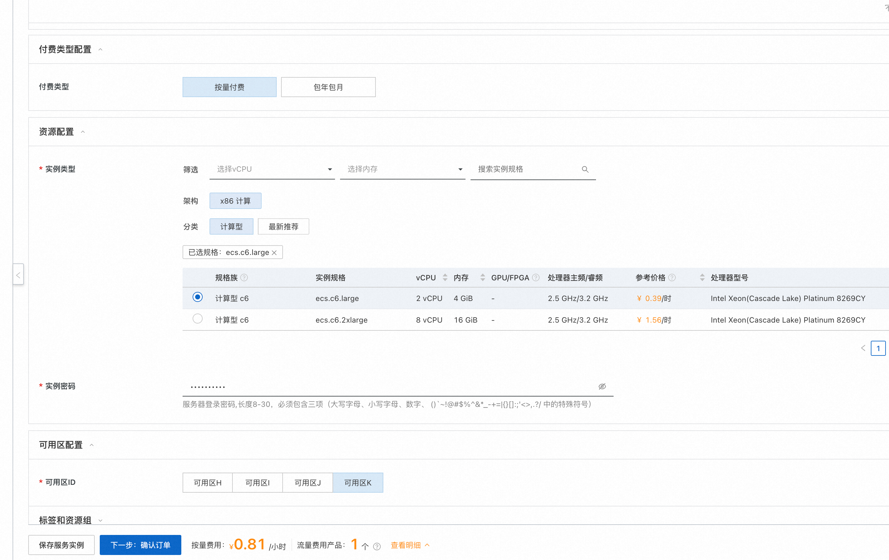
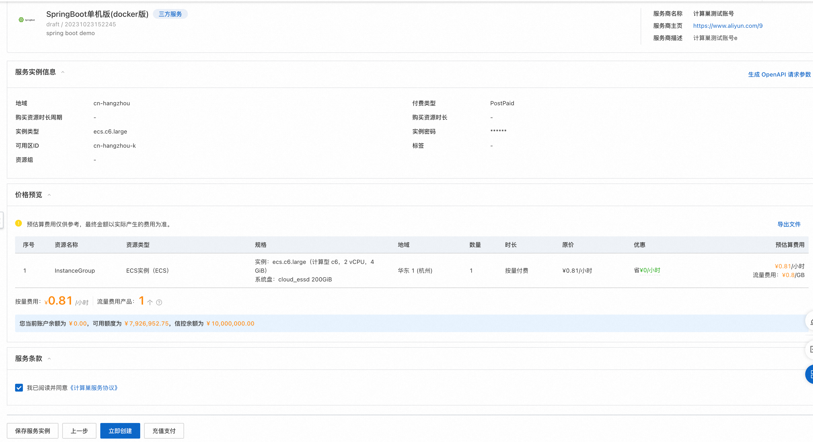
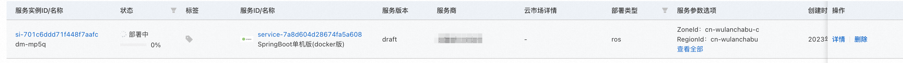
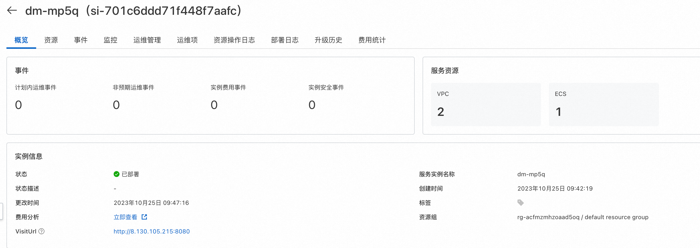

# 服务模板说明文档

## 服务说明

本文介绍基于docker部署的SpringBoot单机ecs服务快速上手流程，本示例对应的Git仓库地址：[springboot-ecs-docker-demo](https://github.com/aliyun-computenest/springboot-ecs-docker-demo)。

本示例会自动的构建计算巢服务，具体的服务构建流程为:

1. 上传docker镜像并构建计算巢容器镜像部署物
2. 创建计算巢服务并关联容器镜像部署物

创建过程大约持续1分钟，当服务变成待提交后构建成功。

## 服务架构

本部署架构为单机ecs部署，通过公网ip 8080端口访问。

## 服务构建计费说明

测试本服务构建无需任何费用，创建服务实例涉及的费用参考服务实例计费说明。

## 服务实例部署流程

### 部署参数说明

| 参数组         | 参数项    | 说明                                                                      |
|-------------|--------|-------------------------------------------------------------------------|
| 服务实例        | 服务实例名称 | 长度不超过64个字符，必须以英文字母开头，可包含数字、英文字母、短划线（-）和下划线（_）。                          |
|             | 地域     | 服务实例部署的地域。                                                              |
|             | 付费类型   | 资源的计费类型：按量付费和包年包月。                                                      |
| ECS实例配置  | 实例类型   | 可用区下可以使用的实例规格。                                                          |
|              | 实例密码   | 长度8-30，必须包含三项（大写字母、小写字母、数字、 ()`~!@#$%^&*-+=&#124;{}[]:;'<>,.?/ 中的特殊符号）。 |
| 网络配置        | 可用区    | ECS实例所在可用区。                                                             |

### 部署步骤

0. 部署链接

1. 单击部署链接，进入服务实例部署界面，根据界面提示，填写参数完成部署。

2. 参数填写完成后可以看到对应询价明细，确认参数后点击**下一步：确认订单**。

3. 确认订单完成后同意服务协议并点击**立即创建**。
   进入部署阶段。

4. 等待部署完成后就可以开始使用服务，进入服务实例详情点击visitUrl。

5. 部署结果：

## 服务详细说明

本文通过将[spring-boot](https://atomgit.com/flow-example/spring-boot)构建后，将deploy.sh和application.jar打包成package.tgz,对其中的application.jar打包成docker镜像,
通过计算巢部署物上传为容器镜像部署物，在模版中使用docker命令进行服务启动。

templates/template.yaml主要由三部分组成
1. Parameters定义需要用户填写的参数，包括付费类型，实例规格和实例密码可用区参数。
2. Resources定义需要开的资源，包括新开的vpc, vswitch和ecs实例, 以及执行命令的定义,其中{{ computenest::acr::dockerconfigjson }}是下载docker所需secret的占位符，计算巢服务会在部署时替换为对应的下载秘钥。{{ computenest::acrimage::demo }}是容器镜像仓库的占位符，计算巢服务会替换成对应的镜像仓库地址。
3. Outputs定义需要最终在计算巢概览页中对用户展示的输出。

## 服务配置

[创建代运维服务完成实例运维](https://help.aliyun.com/zh/compute-nest/create-a-hosted-operations-and-maintenance-service?spm=a2c4g.11186623.0.i24#task-2167552])

[创建包含变配功能的服务](https://help.aliyun.com/zh/compute-nest/use-cases/create-a-service-that-supports-specification-changes-and-change-the-specifications-of-a-service-instance?spm=a2c4g.11186623.0.i3])

[创建包含服务升级功能的服务](https://help.aliyun.com/zh/compute-nest/upgrade-a-service-instance?spm=a2c4g.11186623.0.i17#task-2236803)

## 服务交付

[自定义服务架构图](https://help.aliyun.com/zh/compute-nest/customize-a-service-architecture?spm=a2c4g.11186623.0.0.56e736bfyUdlFm])

[服务文档上线流程](https://help.aliyun.com/zh/compute-nest/use-cases/publish-documents-to-compute-nest?spm=a2c4g.313309.0.i0])

[将服务上架云市场并上到云市场售卖](https://help.aliyun.com/zh/compute-nest/publish-a-service-to-alibaba-cloud-marketplace?spm=a2c4g.11186623.0.i7])

## 其他

[实例代码源地址](https://atomgit.com/flow-example/spring-boot)

[软件包package.tgz构建流程参考](https://help.aliyun.com/document_detail/153848.html)